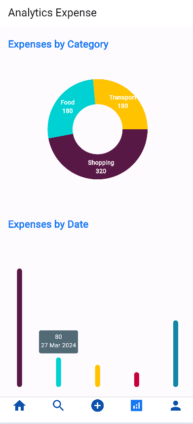

# Expense tracker flutter

Expense Tracker Flutter is a mobile application developed using Flutter framework that helps users manage their expenses efficiently. It provides various features such as signing up, signing in, adding expenses, retrieving expenses, searching expenses, analytics of expense, updating profile information, and more.

## Features

- **Sign Up**: New users can create an account by signing up.
- **Sign In**: Users can sign in to their accounts securely.
- **Add Expense**: Users can add their expenses with details like amount, category, date, and description.
- **Retrieving Expenses**: Users can view their expenses history.
- **Search Expenses**: Users can search for specific expenses using keywords or filters.
- **Analytics Expense**: Users can receive analytics for their expenses.
- **Update Profile**: Users can update their profile information such as name, email, password, etc.

## Frontend

<div style="display: flex; flex-wrap: wrap; justify-content: space-between;">
<div style="flex: 0 0 calc(33.33% - 10px); margin-bottom: 20px;">
  <h3>Sign Up Page</h3>
  
</div>
<div style="flex: 0 0 calc(33.33% - 10px); margin-bottom: 20px;">
  <h3>Sign In Page</h3>
  
</div>
<div style="flex: 0 0 calc(33.33% - 10px); margin-bottom: 20px;">
  <h3>Home Page</h3>
  
</div>
<div style="flex: 0 0 calc(33.33% - 10px); margin-bottom: 20px;">
  <h3>Search Page</h3>
  
</div>
<div style="flex: 0 0 calc(33.33% - 10px); margin-bottom: 20px;">
  <h3>Add Expense Page</h3>
  
</div>
<div style="flex: 0 0 calc(33.33% - 10px); margin-bottom: 20px;">
  <h3>Update Expense Page</h3>
  
</div>
<div style="flex: 0 0 calc(33.33% - 10px); margin-bottom: 20px;">
  <h3>Analytics Expense Page</h3>
  
</div>
<div style="flex: 0 0 calc(33.33% - 10px); margin-bottom: 20px;">
  <h3>Profile Page</h3>
  
</div>
<div style="flex: 0 0 calc(33.33% - 10px); margin-bottom: 20px;">
  <h3>Update Profile Page</h3>
  
</div>
</div>

## Installation

1. Clone the repository:

```
git clone https://github.com/shivam6862/Expense-tracker-flutter.git
```

2. Navigate to the project directory:

```
cd expense-tracker-flutter
```

3. Install dependencies:

```
flutter pub get
```

4. Run the app:

```
flutter run -d chrome
```

## Usage

1. Sign in or sign up to access the expense tracking features.
2. Add your expenses by providing necessary details.
3. View your expenses history and manage them accordingly.
4. Search for specific expenses using keywords or filters.
5. Receive notifications for reminders or alerts related to expenses.
6. Update your profile information as needed.

## Contributing

Contributions are welcome! If you'd like to contribute to this project, please follow these steps:

1. Fork the repository.
2. Create a new branch (`git checkout -b feature/your-feature-name`).
3. Make your changes.
4. Commit your changes (`git commit -am 'Add new feature'`).
5. Push to the branch (`git push origin feature/your-feature-name`).
6. Create a new Pull Request.

## Acknowledgments

Special thanks to [Flutter](https://flutter.dev/) for providing an excellent framework for building beautiful native applications.
